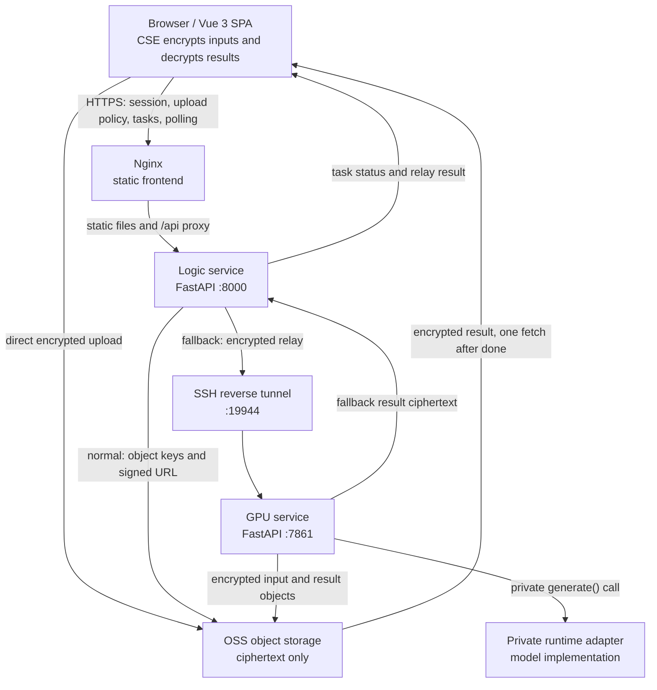

# Show AI Inpainting

[简体中文](docs/README.zh-CN.md)

This repository contains the deployable service boundary for an industrial
anomaly-image generation application. It is intentionally separated from the
research repository: the frontend, public orchestration layer, private GPU API,
encryption boundary, relay fallback, and deployment configuration are kept here,
while model weights and research code remain outside the public source tree.

## Architecture at a glance



The request-level sequence and data-flow diagram is in
[Architecture and data flow](docs/ARCHITECTURE.md).

The browser encrypts each input file with AES-256-GCM and wraps the data key
with the GPU site's RSA public key. OSS and the logic server only handle
ciphertext. The GPU service decrypts input immediately before inference. When
OSS is unavailable, the browser sends the same ciphertext to the logic service,
which forwards it through the SSH tunnel to temporary GPU relay storage.
Generated results are encrypted with the user's browser public key before they
are returned or stored in OSS.

## Interface preview

<p align="center">
  
</p>

<p align="center"><em>Application overview and guided workflow</em></p>

<table>
  <tr>
    <td width="50%" align="center">
      
      <br><em>Image input and region selection</em>
    </td>
    <td width="50%" align="center">
      
      <br><em>Generated result and task controls</em>
    </td>
  </tr>
</table>

## What is included

```text
service_release/
├── frontend/                  Vue 3 + Vite single-page application
├── logic_service/             public API, auth, queue, OSS policy, relay
├── gpu_service/               private HTTP API, CSE, storage, runtime loader
├── configs/                   non-secret TOML examples
├── deploy/                    Nginx and systemd templates
├── docs/                      API, architecture, contract, configuration
├── scripts/                   key rotation and OSS cleanup utilities
└── oss_direct_upload.py      Aliyun OSS policy and object helper
```

The production model runtime is loaded through `gpu_service.runtime_loader`.
The public package does not need to contain private runtime artifacts, site
private keys, OSS credentials, or plaintext archives.

## Local development

Requirements: Python 3.10+, Node.js 18+, and the dependencies listed by each
service. The GPU host needs the private runtime and its own CUDA environment;
the logic service does not need model dependencies.

Install frontend dependencies and build the static application:

```bash
cd frontend
npm ci
npm run dev       # Vite development server
npm run build     # output: frontend/dist/
```

For an API-only smoke setup, use a mock GPU runtime and a spare pair of local
ports. The mock runtime validates service startup and routing; it does not
produce model output.

```bash
GPU_SERVICE_API_KEY='replace-with-a-long-random-key' \
GPU_RUNTIME_BACKEND=mock \
SERVICE_SMOKE_MODE=1 \
GPU_OSS_ENABLED=0 \
python -m gpu_service.server --config configs/gpu.example.toml
```

Start the logic layer in a second shell with the same internal API key and a
five-character activation code:

```bash
GRADIO_ACTIVATION_CODE='ABCDE' \
GRADIO_SESSION_SECRET='replace-with-at-least-32-random-characters' \
GPU_SERVICE_API_KEY='replace-with-a-long-random-key' \
GPU_SERVICE_URL='http://127.0.0.1:7861' \
DIRECT_OSS_UPLOAD_ENABLED=0 \
python -m logic_service.main --config configs/logic.example.toml
```

For a real deployment, set `GPU_RUNTIME_BACKEND=external` and point
`runtime.module` and `runtime.module_path` in the private GPU TOML file at an
external inference adapter that implements the documented runtime contract.
Never put the values above, OSS credentials, or private paths containing
secrets into a committed configuration file.

## Production deployment shape

1. Copy `configs/gpu.example.toml` to a protected GPU-host configuration and
   provide `GPU_SERVICE_API_KEY` through an `EnvironmentFile`.
2. Copy `configs/logic.example.toml` to a protected logic-host configuration
   and provide the activation code, session secret, GPU API key, and OSS
   credentials through protected environment variables.
3. Start the GPU API on loopback port `7861`.
4. Establish the SSH reverse tunnel from the logic host:

   ```bash
   ssh -N \
     -R 127.0.0.1:19944:127.0.0.1:7861 \
     -o ExitOnForwardFailure=yes \
     -o ServerAliveInterval=30 \
     gpu-host
   ```

5. Start `logic_service.main` on loopback port `8000`.
6. Build `frontend/dist/`, deploy it as the Nginx document root, and proxy
   `/api/` and `/cache/` to the logic service.

The example unit files in `deploy/` show the intended systemd boundary. The
only public-facing process is the logic service behind HTTPS; the GPU port and
SSH listener remain loopback-only.

## Configuration

Both services use the same configuration rule:

```text
--config path or *_CONFIG_PATH
  -> environment overrides
  -> TOML values
  -> safe application defaults
```

Secrets are environment-only. The public TOML files contain ports, paths,
timeouts, queue limits, relay limits, and runtime selection. See:

- [Logic service configuration](docs/LOGIC_SERVICE_CONFIG.md) | [中文](docs/LOGIC_SERVICE_CONFIG.zh-CN.md)
- [GPU service contract](docs/GPU_SERVICE_CONTRACT.md) | [中文](docs/GPU_SERVICE_CONTRACT.zh-CN.md)

## Documentation

- [Documentation index](docs/README.md) | [中文](docs/README.zh-CN.md)
- [Public API](docs/API.md) | [中文](docs/API.zh-CN.md)
- [Architecture and data flow](docs/ARCHITECTURE.md) | [中文](docs/ARCHITECTURE.zh-CN.md)
- [Logic service configuration](docs/LOGIC_SERVICE_CONFIG.md) | [中文](docs/LOGIC_SERVICE_CONFIG.zh-CN.md)
- [Logic-to-GPU HTTP contract](docs/GPU_SERVICE_CONTRACT.md) | [中文](docs/GPU_SERVICE_CONTRACT.zh-CN.md)

## Repository boundary

This package is suitable for a public engineering repository, but deployment
secrets must remain outside Git:

- activation codes, session secrets, GPU API keys, and OSS credentials
- protected OSS credential JSON files
- site private keys and key-rotation state
- private runtime artifacts, private runtime modules, and plaintext archives
- production logs and generated data

The included `.gitignore` covers the default private paths. Review it against
your deployment layout before publishing the repository.
