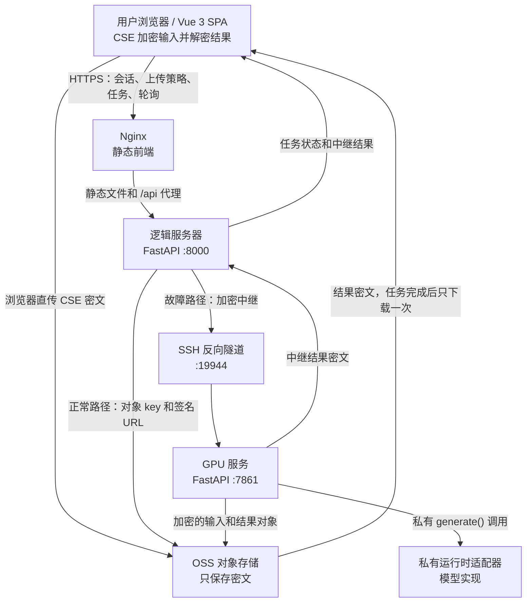
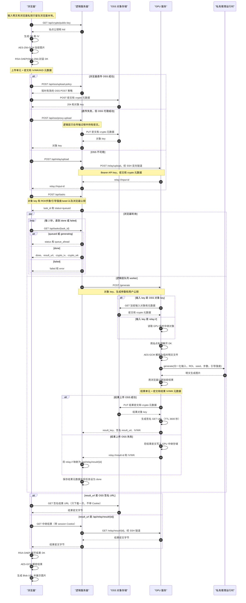

# Show AI Inpainting：架构与实现文档

[English](ARCHITECTURE.md)

> 版本: 2.1 | 更新: 2026-08-26
> 对应现状：前端 Vue3 分离部署 + 公网逻辑层 + 国内 GPU 推理 + OSS 直传/故障中继 + 客户端加密(CSE) + 本地存档
> GPU 与逻辑层的版本化连接规范见 [GPU_SERVICE_CONTRACT.zh-CN.md](GPU_SERVICE_CONTRACT.zh-CN.md)。

---

## 一、整体架构



[英文交互预览](https://saturn756.github.io/ShowAInpainting/diagrams/architecture.en.html) · [中文交互预览](https://saturn756.github.io/ShowAInpainting/diagrams/architecture.zh-CN.html) · [英文 PNG](diagrams/architecture.en.png) · [中文 PNG](diagrams/architecture.zh-CN.png)

两种语言的 HTML 预览使用相同的拓扑和数据路径。静态 PNG 可通过上面的链接获取；在线 HTML 交互预览由 GitHub Pages 工作流提供。

**核心思想**：正常情况下图片通过 OSS 中转；OSS 不可用时，浏览器把同一份 CSE 密文发到公网逻辑层，再通过 SSH 隧道送到 GPU 本地中继目录。两条路径都只把密文交给中间层，GPU 仅在推理前用站点私钥解密，结果也可经逻辑层中继返回浏览器。

### 1.1 一次任务的详细请求与数据流

下面的时序图跟踪一次任务从浏览器加密到结果展示的完整过程。浏览器
是在 GPU 处理期间轮询逻辑层，而不是轮询 OSS；只有任务完成并拿到签名
结果 URL 后，浏览器才从 OSS 下载一次结果密文。



---

## 二、三端职责

| 端 | 技术 | 端口 | 职责 |
|---|---|---|---|
| **前端** | Vue3 + Vite + WebCrypto | dev: 3000 | 激活码登录、图片加密上传、蒙版绘制、ROI 框选、任务提交/轮询、结果解密展示/下载 |
| **公网逻辑层** | FastAPI (Python) | 8000 | 激活码校验 + HMAC 会话、OSS 策略、用户公钥、任务队列、GPU 转发、OSS 代理与中继结果代理 |
| **GPU 服务** | FastAPI + CSE adapter + model runtime | 7861 | API 鉴权、OSS/中继编排、CSE 调用、模型运行时调用、结果输出与本地存档 |

---

## 三、目录结构

```
service_release/
├── gpu_service/
│   ├── server.py              # GPU API 编排层
│   ├── config.py              # TOML + 环境变量配置
│   ├── contracts.py           # HTTP 请求/响应模型
│   ├── crypto_service.py      # CSE 密钥与加解密
│   ├── storage_service.py     # relay 临时对象生命周期
│   ├── runtime_protocol.py    # 模型运行时接口
│   ├── runtime_loader.py      # 惰性选择并加载 runtime
│   ├── mock_runtime.py        # smoke/mock runtime
│   └── requirements.txt
├── configs/
│   ├── gpu.example.toml       # GPU 非敏感启动配置示例
│   └── logic.example.toml  # 逻辑层非敏感启动配置示例
├── logic_service/
│   ├── main.py                # 逻辑层 HTTP API 与任务编排
│   ├── config.py              # 逻辑层 TOML + 环境变量配置
│   └── requirements.txt
├── frontend/                  # Vue3 前端
├── deploy/                   # Nginx 与两端 systemd 示例
└── docs/
    ├── API.md
    ├── ARCHITECTURE.md
    ├── GPU_SERVICE_CONTRACT.md
    └── LOGIC_SERVICE_CONFIG.md
```

真实生产推理适配器、运行时资源、私钥和本地存档位于 service_release 外部，
通过 `runtime.module`、`runtime.module_path` 和受保护配置注入。

### 3.1 配置边界

逻辑层通过 `--config /path/to/logic.toml` 或
`LOGIC_CONFIG_PATH` 选择 TOML。环境变量覆盖 TOML，命令行只负责选择
配置文件。TOML 只保存端口、路径、超时、队列限制和重试策略；激活码、
Session 签名密钥、GPU API key 和 OSS 凭证始终从受保护环境读取。

```bash
GRADIO_ACTIVATION_CODE='ABCDE' \
GRADIO_SESSION_SECRET='at-least-32-character-secret' \
GPU_SERVICE_API_KEY='same-as-gpu-service' \
python -m logic_service.main --config /etc/anomaly-gen/logic.toml
```

配置文件示例位于 `configs/logic.example.toml`，systemd 模板位于
`deploy/logic-service.service.example`。生产部署时将示例复制到
`/etc/anomaly-gen/`，并把敏感环境变量写入权限为 `0600` 的
`/etc/anomaly-gen/logic.env`。

## 四、认证与会话

- 用户在激活页输入 5 位激活码 `POST /api/auth/activate`。
- 激活码用 `hmac.compare_digest` 常数时间比较；失败按 IP（`x-forwarded-for` 最后一个）限流：15 分钟内最多 5 次，超限返回 429。
- 成功后签发 HMAC-SHA256 签名 token：`<expiresAt>.<nonce>.<signature>`，写入 HttpOnly Cookie `anomaly_generation_access`，有效期 12h，`Secure` + `SameSite=Lax`。
- 受保护接口依赖 `require_session`：解析 Cookie → 校验签名与过期 → 返回 `owner`（`sha256(token)` 的用户指纹）。
- 前端 `useApi.js` 在任意 401 时派发 `auth:expired` 事件，`App.vue` 监听后清 token 并回到激活页；`checkSession()` 使用受保护的 `GET /api/tasks` 校验（不能用无鉴权的 `/health`）。

---

## 五、客户端加密（CSE）— 数据安全核心

### 5.1 为什么要 CSE

SSE（服务端加密，OSS/KMS）密钥在阿里云手里，管理员可解。要「连阿里云都拿不到」，必须**客户端加密**：数据在我们自己的环境加密成密文后才进 OSS。

### 5.2 信封格式（JS 与 Python 两侧完全一致）

```
每张图片：
  ① 随机生成 32 字节数据密钥 DK (AES-256-GCM)
  ② DK 加密图片内容 → 密文（AES-GCM，12 字节 IV，密文末尾含 16 字节 tag）
  ③ DK 用 RSA-OAEP(SHA-256) 封装 → WK（256 字节）
  ④ 上传：密文作为对象内容；IV / WK 存入对象元数据
     x-oss-meta-crypto-iv = base64(IV)
     x-oss-meta-crypto-wk = base64(WK)
  读取时反向：WK → RSA 私钥解出 DK → AES-GCM 解密
```

### 5.3 两把密钥

| 密钥 | 位置 | 用途 |
|---|---|---|
| **站点公钥/私钥** | 公钥经逻辑层 `/api/crypto/public-key` 动态下发（前端缓存）；**私钥只在 GPU 服务器**（见 5.5，每日轮换） | 解密所有**上传**（背景/参考/蒙版） |
| **用户公钥/私钥** | 浏览器激活时 WebCrypto 生成；**私钥只存 localStorage**，公钥 `POST /api/keys` 注册到逻辑层 | 加密**生成结果**，浏览器用私钥解密 |

> ⚠️ **信任边界**：明文必然存在于 GPU 服务器内存（推理需要）+ 本地存档 + 用户自己的浏览器。OSS 中只有密文。

### 5.4 兼容性验证

信封算法在 JS `crypto.subtle` 与 Python `cryptography` 间双向实测互通（Node WebCrypto 加密→Python 解密、Python 加密→JS 解密均验证通过）。

### 5.5 站点主密钥每日轮换

- `scripts/rotate_site_key.py` 每日（cron 04:41）生成新 RSA-2048 密钥对到 `data/crypto/keys/<日期>/`，并更新 `data/crypto/current.json`（含当前 `kid`）。
- **历史密钥全部留存**（`keys/<日期>/` + 遗留 `site_master_private.pem`），GPU 服务按对象元数据里的 `x-oss-meta-crypto-kid` 选对应私钥解密；kid 缺失或失配时逐个尝试历史密钥。
- 前端通过 `/api/crypto/public-key` **动态获取当前公钥 + kid**（内嵌一份旧公钥做兜底），上传时在元数据里带上 `kid`。
- 轮换影响面：仅上传解密与公钥分发；**生成结果用用户公钥加密，不受站点轮换影响**。
- 私钥缓存按 `current.json` 的 mtime 懒刷新（每日一次），无需重启 GPU 服务。

---

## 六、上传链路

```
浏览器 file ── 压缩(背景→512/参考→2048) ── WebCrypto 加密 ──► CSE 密文
   │
   ├─ 首选：直传 OSS（带 10s 超时）
   │   GET /api/oss/upload-policy → 浏览器 POST 密文到 OSS
   │
   ├─ 次选：逻辑服务器 OSS 代理
   │   POST /api/oss/proxy-upload → 逻辑层 POST 密文到 OSS
   │
   └─ OSS 不可用：GPU 中继备用链路
       POST /api/relay/upload → SSH 反向隧道 → GPU /relay/upload
       GPU 暂存密文 + crypto_iv/wk/kid，任务 key 使用 relay://<id>
```

- 前端按“直传 OSS → 逻辑服务器 OSS 代理 → GPU 中继”顺序自动降级。
- 逻辑服务器层只转发中继密文，不持有站点私钥；GPU 在 `generate` 读取 `relay://` 时按同一套 RSA-OAEP(SHA-256) + AES-256-GCM 流程解密。
- 生成结果上传 OSS 失败时，GPU 把结果暂存为中继对象；逻辑层把它代理为 `/api/relay/result/<id>`，前端按用户公钥解密展示。
- 中继文件默认位于 GPU `/tmp/anomaly_gpu_relay`，按 TTL 自动清理；任务结束时输入中继立即清理。
- 直传策略在 `oss_direct_upload.py` 的 `create_upload_policy` 中签发：`conditions` 含 `starts-with $x-oss-meta-crypto-iv/wk/kid ""` 放行密文元数据。
- **不再调用 `/api/oss/import` 阻塞确认**（历史遗留：预览用本地明文、密文无法校验，可见性由 GPU 下载时自行轮询）。`/api/oss/import` 接口保留供兼容。
- 针对跨国用户（如新西兰导师直连上海 OSS 仅 ~18KB/s），浏览器仍会先压缩图片并给直传设置 10s 超时。
- **预览永远用浏览器本地明文**（`URL.createObjectURL`），不展示上传密文。
- 上传成功/失败会刷新底部状态提示（`refreshUploadHint`）。

---

## 七、任务队列（逻辑层内存实现）

- `_TASKS: dict[task_id → task]`，内存存储，全局互斥锁 `_TASK_LOCK`。
- 每用户最多 **5 个任务**（`_MAX_TASKS_PER_USER`），提交时统计队列中该用户任务数，满则返回 429。
- FIFO：`_process_next_task()` 取 `created_at` 最早的一个 `queued` 任务置为 `generating`，调用完成后递归调度下一个（并发仅 1 个推理）。
- 预计等待时间按 `_ESTIMATED_SECONDS_PER_TASK=8s` 估算返回给前端。
- 如果部署环境提供可选的内置参考图目录，任务提交时会解析对应的静态 key 并导入 OSS；该目录不属于公开代码包。
- 任务状态流转：`queued → generating → done | failed`；TTL 1h 清理。

### 任务 → GPU 请求

```jsonc
POST {GPU_SERVICE_URL}/generate
{
  "background_key": "...", "reference_key": "...", "mask_key": "...",
  "roi": {"x":0,"y":0,"width":128,"height":128},   // 可选
  "ddim_steps": 50, "guidance_scale": 7.5, "seed": 42,
  "task_id": "<逻辑层任务id>",           // 存档溯源
  "user_public_key": "<用户公钥 PEM>"      // 结果加密用
}
```

---

## 八、生成链路（GPU 服务）

1. **下载 + 解密**：`_download_from_oss()` 下载对象，读 `x-oss-meta-crypto-*` 元数据，有则用站点私钥解密（明文仅存 `/tmp/gpu_inference` 临时目录），无则视为明文（内置 demo 图）。
2. **预处理**：背景/参考/蒙版均 resize 到 512×512；ROI 裁切（取正方形大边，像素坐标在 resize 前）；蒙版阈值化。
3. **推理**：通过外部推理适配器的 `generate()` 契约执行；具体实现、权重和模型参数由私有适配器管理。
4. **结果输出**：若请求带 `user_public_key`，先用用户公钥加密结果（`_encrypt_result_file`）；优先上传 OSS，OSS 不可用时写入 GPU 中继目录并由逻辑层代理返回，响应仍包含 `crypto_iv/crypto_wk`；无公钥时兼容明文输出。
5. **本地存档**：见 §十。

### 生成响应

```jsonc
{
  "result_key": "openoctopus/output/results/<owner_hash>/<uuid>.jpg", // OSS 正常路径
  "result_url": "<OSS 签名 URL>",     // 或 /api/relay/result/<id>
  "elapsed_seconds": 8.3,
  "crypto_iv": "<base64>", "crypto_wk": "<base64>"   // 结果加密时返回
}
```

---

## 九、结果展示与解密（前端）

- 任务轮询（2s）收到 `done` 后，若带 `crypto_iv/crypto_wk`：`fetch(result_url)` 拉密文 → `decryptPayload()`（用户私钥解 WK → AES-GCM 解密）→ objectURL 显示与下载。
- 无 crypto 元数据（明文兜底）则直接用签名 URL。
- 下载按钮同样基于解密后的 blob。

---

## 十、本地存档（GPU 服务器）

每次推理后把任务数据整理保存到 `data/anomaly_records/`：

```
data/anomaly_records/<日期>/<owner_hash>/<task_id>/
├── 0_stitched.png   拼接图 2×2：参考 | 背景 / 蒙版 | 结果（1024×1024）
├── 1_reference.png  最终参考图（ROI 裁剪后 512×512）
├── 2_background.png 背景图（512×512）
├── 3_mask.png       蒙版（512×512）
├── 4_result.png     生成结果（明文）
└── meta.json        task_id/seed/steps/scale/ROI/各 OSS key/是否加密/时间
```

- 环境变量 `ANOMALY_DATA_DIR` 改路径，`ANOMALY_ARCHIVE_ENABLED=0` 可关。
- 存档失败只打日志，不阻塞主流程。**这是 OSS 删除措施的前提**：本地有明文记录，OSS 密文可放心清理。

---

## 十一、数据清理

- 脚本 `scripts/oss_weekly_cleanup.py`：遍历 `input/`、`output/` 前缀，删除超过 `--max-age-days` 天的对象（全绝对路径，可在任意目录运行；支持 `--dry-run`）。
- cron：**每 3 天** 03:17 运行，`--max-age-days 3`，日志 `service_outputs/oss_cleanup.log`。
- OSS 中为密文，删除无泄露风险；本地存档不受影响。

---

## 十二、网络与部署

### 12.1 SSH 反向隧道（逻辑服务器 → 国内 GPU）

```bash
ssh -N -R 127.0.0.1:19944:127.0.0.1:7861 \
    -i /path/to/protected/tunnel-key \
    -o ServerAliveInterval=30 -o ExitOnForwardFailure=yes \
    logic-host
```

### 12.2 国内 GPU 服务（本机）

```bash
export GPU_SERVICE_API_KEY='replace-with-a-long-random-key'
# 可选：OSS_CONFIG_PATH / SITE_PRIVATE_KEY_PATH / ANOMALY_DATA_DIR
cd service_release
python -m gpu_service.server --config /etc/anomaly-gpu/gpu.toml
# 监听 127.0.0.1:7861
```

### 12.3 公网逻辑层 + Nginx

- 代码部署在逻辑服务安装目录（包含 `logic_service/`、`frontend/dist/` 和受保护配置）。
- 启动（screen 会话 `anomaly`）：
  ```bash
  # /etc/anomaly-gen/logic.env 提供三个敏感变量
  set -a; . /etc/anomaly-gen/logic.env; set +a
  cd /srv/anomaly-logic
  python3 -u -m logic_service.main \
    --config /etc/anomaly-gen/logic.toml \
    > /var/log/anomaly-logic/service.log 2>&1
  ```
- 推荐使用 `deploy/logic-service.service.example` 作为 systemd 模板，
  避免把启动参数散落在 shell 历史或 screen 命令中。
- Nginx：使用部署者自己的 HTTPS 域名，`/api/` → 8000，`/cache/` → 8000，SPA 回退 `index.html`，`client_max_body_size 30m`。

### 12.4 前端

```bash
cd service_release/frontend
npm run build       # 产物 dist/ 部署到逻辑服务的 Nginx 文档根目录
npm run dev         # 本地开发，proxy /api → 127.0.0.1:8000
```

### 12.5 OSS

- OSS 桶和 `input`/`output` 前缀由受保护配置注入；不要写入公开文档中的真实值。
- CORS：允许部署域名，`AllowedMethods=['GET','POST','PUT','HEAD']`（必须含 GET，浏览器解密结果要 fetch 密文）。

---

## 十三、API 清单

| 方法 | 路径 | 鉴权 | 说明 |
|---|---|---|---|
| POST | `/api/auth/activate` | 无 | 激活码换 session（写 Cookie） |
| POST | `/api/keys` | 会话 | 注册用户公钥（结果加密用） |
| POST | `/api/oss/upload-policy` | 会话 | 签发浏览器直传 POST 策略 |
| POST | `/api/oss/import` | 会话 | 确认对象可见，返回 URL |
| POST | `/api/oss/proxy-upload` | 会话 | 逻辑服务器代理上传到 OSS（密文 + crypto 字段） |
| POST | `/api/relay/upload` | 会话 | OSS 不可用时转发密文到 GPU 中继 |
| GET | `/api/relay/result/{id}` | 会话 | 代理 GPU 中继结果，按任务用户隔离 |
| POST | `/api/tasks` | 会话 | 提交生成任务 |
| GET | `/api/tasks/{id}` | 会话 | 查询任务状态/结果/密文元数据 |
| GET | `/api/tasks` | 会话 | 当前用户任务列表 + 结果画廊 |
| GET | `/api/health` | 无 | 健康检查 |
| GET | `/health` | 无 | GPU 服务健康（CUDA/设备） |
| POST | `/generate` | Bearer | GPU 推理（OSS/relay 输入，OSS/relay 输出） |
| POST | `/relay/upload` | Bearer | GPU 暂存输入密文 |
| GET | `/relay/result/{id}` | Bearer | GPU 返回中继结果 |

---

## 十四、环境变量汇总

| 变量 | 服务 | 说明 |
|---|---|---|
| `GRADIO_ACTIVATION_CODE` | 逻辑层 | 5 位激活码 |
| `GRADIO_SESSION_SECRET` | 逻辑层 | ≥32 位会话签名密钥 |
| `GPU_SERVICE_URL` / `GPU_SERVICE_API_KEY` | 逻辑层 | GPU 服务地址（隧道 19944）与内部密钥 |
| `DIRECT_OSS_UPLOAD_ENABLED` | 逻辑层 | 是否启用 OSS 直传/代理 |
| `RELAY_UPLOAD_TIMEOUT_SECONDS` / `RELAY_UPLOAD_MAX_BYTES` | 逻辑层 | GPU 中继请求超时/单文件大小上限 |
| `LOGIC_CONFIG_PATH` | 逻辑层 | TOML 配置文件路径（也可用 `--config`） |
| `LOGIC_SERVICE_HOST` / `LOGIC_SERVICE_PORT` | 逻辑层 | 监听地址与端口覆盖 |
| `LOGIC_CACHE_DIR` / `LOGIC_DEMO_DIR` | 逻辑层 | 上传缓存与内置参考图目录覆盖 |
| `LOGIC_*` / `GPU_*` timeout/retry 变量 | 逻辑层 | TOML 中对应值的环境覆盖 |
| `OSS_CONFIG_PATH` | 两者 | 受保护 OSS 凭证 JSON 文件路径 |
| `GPU_OSS_ENABLED` | GPU | 是否启用 OSS；关闭后仅使用 relay 输出 |
| `RELAY_STORAGE_DIR` / `RELAY_MAX_UPLOAD_BYTES` / `RELAY_TTL_SECONDS` | GPU | 中继目录、大小上限、TTL |
| `GPU_SERVICE_API_KEY` | GPU | ≥16 字符内部密钥 |
| `GPU_RUNTIME_BACKEND` / `GPU_RUNTIME_MODULE` / `GPU_RUNTIME_MODULE_PATH` | GPU | mock 或外部推理适配器选择 |
| `SITE_PRIVATE_KEY_PATH` | GPU | 站点私钥遗留路径（默认 `data/crypto/site_master_private.pem`）；每日轮换密钥在 `data/crypto/keys/<日期>/` |
| `ANOMALY_DATA_DIR` / `ANOMALY_ARCHIVE_ENABLED` | GPU | 本地存档路径/开关 |

---

## 十五、安全模型小结

1. **数据最小暴露**：OSS 只存密文，私钥在 GPU 服务器与用户浏览器，阿里云无法解密；删除措施（§十一）进一步缩短留存窗口。
2. **会话安全**：HttpOnly Cookie + HMAC 签名 + 限流 + 12h 过期；前端 401 自动回激活页。
3. **私钥安全**：
   - 站点私钥需**备份**，丢失后已加密上传图片不可恢复；
   - 用户私钥在 localStorage，清缓存后旧结果不可解密（新结果不受影响）。
4. **不可避免的明文点**：GPU 服务器内存（推理）+ 本地存档 + 用户浏览器。若对 GPU 服务器本身的入侵也在威胁模型内，需再加磁盘加密/HSM，属后续增强项。

---

## 十六、常见运维操作

| 操作 | 命令 |
|---|---|
| 重启 GPU 服务 | `systemctl restart anomaly-gpu`（或按 §12.2 手动启动） |
| 重启逻辑层 | `systemctl restart anomaly-logic`（或按 §12.3 手动启动） |
| 部署前端 | `cd service_release/frontend && npm run build` → 上传 `dist/*` 到 Nginx 文档根目录 |
| 试运行清理 | `python scripts/oss_weekly_cleanup.py --dry-run --max-age-days 3` |
| 查看清理日志 | `tail service_outputs/oss_cleanup.log` |
| 手动轮换站点密钥 | `python scripts/rotate_site_key.py`（幂等，当日已有则跳过；`--force` 强制） |
| 查看轮换日志 | `tail service_outputs/key_rotation.log` |
| 查看当前站点公钥 | `curl http://127.0.0.1:7861/public-key` 或 `curl https://your-domain.example/api/crypto/public-key` |


---

## 3.1 GPU 服务内部边界

GPU 服务现在按以下依赖方向组织，禁止反向依赖：

```text
HTTP/API 编排(server.py)
    ├── 文件适配器(OSS / relay)
    ├── CSE 服务(crypto_service.py)
    └── 外部推理适配器(runtime_loader.py)
```

- `server.py` 不实现 RSA/AES 算法，也不导入研究运行时或模型类。
- `crypto_service.py` 不处理 HTTP、OSS、relay 或模型；它只接受本地文件与 CSE 元数据。
- 外部推理适配器不处理 HTTP、OSS、密钥或用户会话；它只实现模型生命周期和 `generate()`。生产环境可通过 `runtime.module` 与 `runtime.module_path` 从 service_release 外部加载私有模块。
- 前置逻辑层只依赖 HTTP 契约，不依赖 GPU 内部 Python 模块。替换模型时，只替换模型运行时，不改变前置服务接口。
- 公开仓库可公开 API 编排、CSE 协议、runtime protocol 和 mock runtime；真实运行时资源、私钥和研究实现放在部署环境或私有包中。
