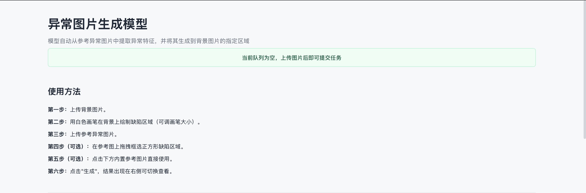
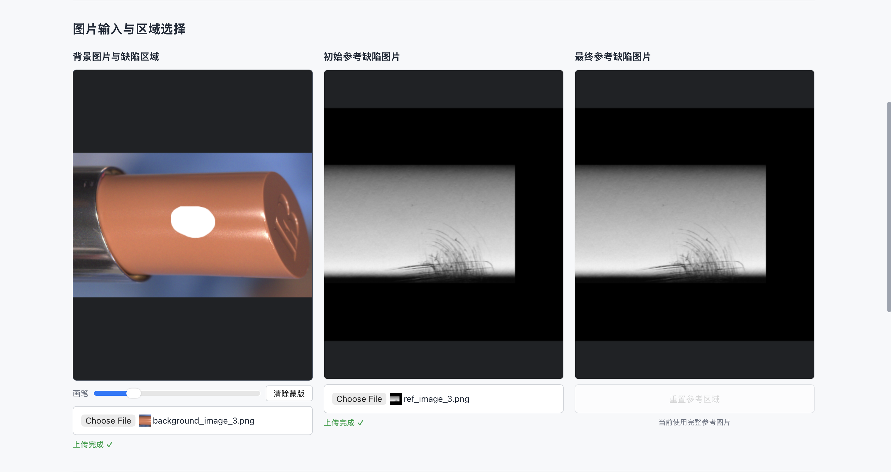
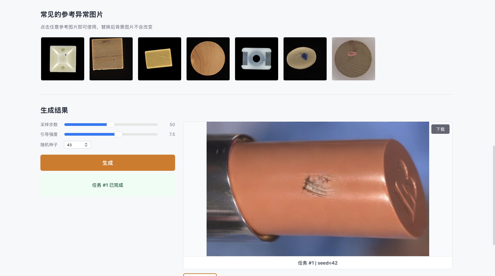

# Show AI Inpainting Documentation

This directory contains the interface and architecture documentation for the
service package. The root [README](../README.md) is the short GitHub entry
point; the documents below describe how the deployed pieces connect.

## Reading order

| Topic | English | Simplified Chinese |
|---|---|---|
| Public API | [API.md](API.md) | [API.zh-CN.md](API.zh-CN.md) |
| Architecture and data flow | [ARCHITECTURE.md](ARCHITECTURE.md) | [ARCHITECTURE.zh-CN.md](ARCHITECTURE.zh-CN.md) |
| GPU service contract | [GPU_SERVICE_CONTRACT.md](GPU_SERVICE_CONTRACT.md) | [GPU_SERVICE_CONTRACT.zh-CN.md](GPU_SERVICE_CONTRACT.zh-CN.md) |
| Logic service configuration | [LOGIC_SERVICE_CONFIG.md](LOGIC_SERVICE_CONFIG.md) | [LOGIC_SERVICE_CONFIG.zh-CN.md](LOGIC_SERVICE_CONFIG.zh-CN.md) |

Recommended order: read the API overview first, then the architecture and
data flow, followed by the private GPU contract and configuration reference.

## Service boundary

```text
Browser -> Nginx/HTTPS -> Logic service :8000
                         -> SSH reverse tunnel :19944
                         -> GPU service :7861
```

The browser never calls the GPU API directly. The logic service owns public
authentication, the in-memory task queue, OSS upload policy, and relay
fallback. The GPU service owns the private key boundary, temporary relay
storage, runtime adapter, result output, and local archive.

## Interface Preview

<p align="center">
  
</p>

<p align="center"><em>Application overview and guided workflow</em></p>

<table>
  <tr>
    <td width="50%" align="center">
      
      <br><em>Image input and region selection</em>
    </td>
    <td width="50%" align="center">
      
      <br><em>Generated result and task controls</em>
    </td>
  </tr>
</table>

## Public repository rule

The documents describe interfaces rather than the private research system.
Private runtime artifacts, private runtime modules, site private keys, OSS
credentials, activation codes, plaintext archives, and production logs must
remain outside the repository.
